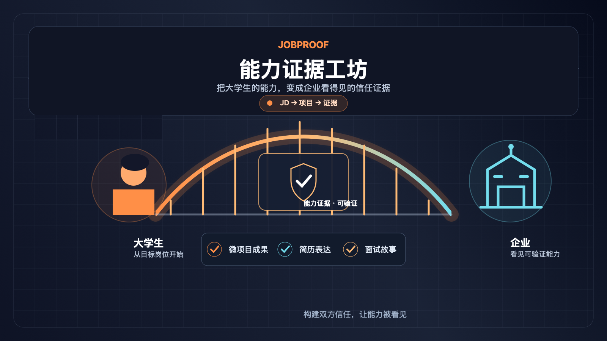

# JobProof v0.2

JobProof（能力证据工坊）帮助大学生把目标岗位 JD 转化为能力差距、可执行微项目和可展示的求职证据。



核心链路：

```text
目标 JD → 能力拆解与匹配解释 → 7/14 天微项目 → 证据完整度 → 求职表达
```

## v0.2 已实现

- 四步 onboarding：背景、能力自评、事实与证据、能力画像确认。
- JD 文本分析：提取能力要求，保留 JD 原文依据，输出匹配总分与分项解释。
- 缺口驱动的 7/14 天微项目：任务包含预计用时、交付物、验收标准和关联能力。
- 本地 Repository：在浏览器 `localStorage` 保存演示阶段的画像、JD 分析、计划和证据。
- 证据工作台：填写背景、任务、行动、结果、反思，并显示完整度和待补充字段。
- 求职表达：从证据生成简历 bullet、作品集案例和 STAR 面试故事草稿。
- 可选知乎接入：OAuth 登录、账号基础信息、公开关注/创作列表和知乎热榜。
- 服务端安全边界：OAuth Token、App Key 和 Access Secret 不进入前端响应、URL、日志或 Git。

未配置知乎时，核心的「JD → 微项目 → 证据 → 求职表达」流程仍可正常使用。

## 本地开发

要求 Node.js 18.18+，推荐使用 Node.js 20 LTS。

```bash
npm ci
npm run dev
```

打开 <http://localhost:3000>。

常用命令：

```bash
npm run check:structure  # 检查 v0.2 入口、文档、素材和忽略规则
npm run test:unit        # 运行项目结构单元测试
npm run typecheck        # TypeScript 类型检查
npm run lint             # ESLint，warning 视为失败
npm run test             # 结构检查 + 单元测试 + 类型检查
npm run build            # 生产构建
npm run test:smoke       # 启动生产服务并验证 HTTP 核心接口
```

## 页面与接口

主要页面：

| 路径 | 用途 |
| --- | --- |
| `/` | 产品入口 |
| `/onboarding` | 能力画像 onboarding |
| `/dashboard` | 能力、计划、证据和岗位概览 |
| `/jobs` | 粘贴 JD 并查看匹配分析 |
| `/plan` | 配置和执行 7/14 天微项目 |
| `/evidence` | 提交成果并检查证据完整度 |
| `/expressions` | 生成和编辑求职表达 |
| `/account` | 知乎登录、用户信息、关注和创作列表 |
| `/zhihu-hot` | 知乎热榜 |

服务端 Route Handlers：

| 方法与路径 | 说明 |
| --- | --- |
| `POST /api/jobs/analyze` | 校验 JD 和画像，返回能力拆解与匹配解释 |
| `GET /api/auth/login` | 发起知乎 OAuth |
| `GET /api/auth/callback` | 校验 state 并创建服务端会话 |
| `GET /api/auth/me` | 返回当前会话中的知乎基础信息 |
| `POST /api/auth/logout` | 删除当前知乎会话 |
| `GET /api/zhihu/hot` | 获取知乎热榜 |
| `GET /api/zhihu/followees` | 获取授权用户的公开关注列表 |
| `GET /api/zhihu/contents` | 获取授权用户的公开创作列表 |

接口失败、未登录、空数据和未配置凭证时，页面会显示对应的降级状态；不会把鉴权失败伪装成空结果。

## 环境变量

复制模板：

```bash
cp .env.example .env.local
```

| 变量 | 用途 | 必填 |
| --- | --- | --- |
| `NEXT_PUBLIC_APP_NAME` | 预留的应用名称配置，当前核心流程不依赖 | 否 |
| `NEXT_PUBLIC_APP_URL` | OAuth 回调重定向使用的应用地址 | 生产环境建议填写 |
| `ZHIHU_OAUTH_APP_ID` | 知乎 OAuth App ID | 使用知乎登录时必填 |
| `ZHIHU_OAUTH_APP_KEY` | 知乎 OAuth App Key | 使用知乎登录时必填 |
| `ZHIHU_OAUTH_REDIRECT_URI` | 知乎后台登记的 OAuth 回调地址 | 使用知乎登录时必填 |
| `ZHIHU_ACCESS_SECRET` | 服务端调用知乎用户数据、热榜接口 | 使用热榜/关注/创作时必填 |

本地回调示例：

```text
ZHIHU_OAUTH_REDIRECT_URI=http://localhost:3000/api/auth/callback
```

生产回调必须使用 HTTPS，并与知乎开放平台及黑客松项目页面登记的值完全一致，例如：

```text
ZHIHU_OAUTH_REDIRECT_URI=https://zhihujobproof.netlify.app/api/auth/callback
```

不要把真实密钥写入 `.env.example`、源码、截图、日志或前端代码。会话优先使用 Netlify Blobs；本地或未配置 Blobs 时回退到单实例内存，因此内存回退不适用于多实例生产环境。

## 部署到 Netlify

仓库根目录的 `netlify.toml` 已声明：

```toml
[build]
  command = "npm run build"
```

Netlify 使用 Next.js 官方插件处理发布目录。站点环境变量至少配置：

- `ZHIHU_OAUTH_APP_ID`
- `ZHIHU_OAUTH_APP_KEY`
- `ZHIHU_OAUTH_REDIRECT_URI`

只有需要知乎热榜、关注和创作列表时才配置 `ZHIHU_ACCESS_SECRET`。部署完成后，至少检查首页、`/jobs`、`/account` 未配置提示，以及 `/api/auth/me` 的未登录响应。

## 项目结构

```text
app/              页面与 Next.js Route Handlers
components/       可复用交互组件
lib/              Domain Schema、Repository、匹配、计划、证据和知乎服务
docs/              PRD、技术设计、OAuth 设计、项目计划书和迭代路线图
public/            黑客松提交用封面和项目图标
scripts/           结构检查与 HTTP 冒烟测试
tests/             Node.js 单元测试
netlify.toml       Netlify 构建配置
```

## 文档

- [产品需求文档](docs/产品需求文档-PRD.md)
- [技术设计文档](docs/技术设计文档.md)
- [v0.2 知乎画像与 OAuth 设计](docs/v0.2-知乎画像与OAuth设计.md)
- [项目详情计划书](docs/项目详情计划书.md)
- [v0.2 迭代路线图](docs/迭代路线图-v0.2.md)

## 黑客松提交检查

知乎黑客松要求作品具备可访问 Demo 和产品说明/计划书。提交前确认：

1. 公网 Demo 可以完成一条核心链路：输入 JD → 查看缺口 → 创建微项目 → 提交证据 → 生成表达。
2. 项目名称、赛道、介绍、封面、图标和计划书均已填写。
3. OAuth 回调地址与知乎后台及赛事页面登记值完全一致。
4. 线上环境变量已配置，仓库中没有 App Key、Access Secret 或 OAuth Token。
5. 未授权、接口失败、空数据和额度/凭证不可用时都有可理解的提示。
6. 部署提交、代码仓库和演示视频（如提供）均可被评委访问。

当前版本已在本地通过结构检查、单元测试、TypeScript 检查、ESLint、生产构建和 HTTP 冒烟测试；公网部署与真实知乎账号 OAuth 联调仍需在 Netlify 和知乎后台完成。
